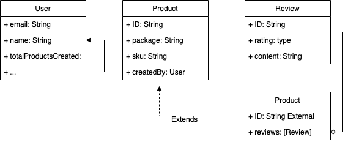

# Demonstration of AWS AppSync API in a federated graphQL setup

:information_source: Related blog post : https://aws.amazon.com/blogs/mobile/federation-appsync-subgraph/

:warning: *This is a project built for demo purpose and is not meant for production use.*

Demo compliant with [Apollo GraphQL Federation (V2) spec](https://www.apollographql.com/docs/federation/).

# TL;DR;

## Deploy

```
npm ci
npm run build
npm run cdk bootstrap
npm run cdk deploy
```

## Test

After deployment go to https://studio.apollographql.com/sandbox/explorer and set the endpoint to the one given `FederatedAppsyncApiDemoStack.FederationGatewayApiEndpoint` output of `cdk deploy` command.

## Destroy

```
cdk destroy
```

# Details

This repo shows we how you can mix subgraphs served by an Apollo Server and an AWS AppSync (https://aws.amazon.com/appsync/) managed one.

Check the [official blog post](https://aws.amazon.com/blogs/mobile/federation-appsync-subgraph/) for more details.

The global graph looks like this:



And its definition is spread accross 3 independants piece of infrastructure defining each:
* Product: `lib/products-service.graphql`
* Review: `lib/reviews-service.Server.ts`
* User: `lib/users-service.Server.ts`


In this repo you will:

1. Deploy and expose the products service graphql API in AWS AppSync
1. Deploy users and reviews service in Apollo Servers hosted by AWS Lambda and exposed by AWS ApiGateway
1. Federate those three services subgraph schema with Apollo Gateway hosted by AWS Lambda and exposed by AWS ApiGateway
1. Test them with cross boundary queries using Apollo Studio sandbox explorer (https://studio.apollographql.com/sandbox/explorer)


PS: The entire setup is delivered as a CDK app to simplify deployments but all Apollo based servers and gateway can be run locally.

## Pre requisite

In order to deploy the demonstrator, you will need the following prerequisites:

* An active AWS account
* Node 16 or above
* The AWS CDK
* git client

## Deploy the CDK app

To deploy the demonstrator run the following

```
git clone https://github.com/flochaz/federated-appsync-api-demo
cd federated-appsync-api-demo
npm run cdk bootstrap
npm run cdk deploy
```

The output will be the different endpoints deployed:

```
✅ FederatedAppsyncApiDemoStack

Outputs:
FederatedAppsyncApiDemoStack.*FederationGatewayEndpointC91B8CA6* = https://AAAAAA.execute-api.eu-west-1.amazonaws.com/prod/ (https://x4gut54tu9.execute-api.eu-west-1.amazonaws.com/prod/)
FederatedAppsyncApiDemoStack.ProductsServiceApiEndpoint496D7B0F = https://BBBBBBB.appsync-api.eu-west-1.amazonaws.com/graphql (https://rbet7v5hpvhrrnhpy3y6rvdzi4.appsync-api.eu-west-1.amazonaws.com/graphql)
FederatedAppsyncApiDemoStack.ReviewsServiceApiEndpoint5B523BB2 = https://CCCC.execute-api.eu-west-1.amazonaws.com/prod/ (https://j0o2bxgtdi.execute-api.eu-west-1.amazonaws.com/prod/)
FederatedAppsyncApiDemoStack.UsersServiceApiEndpoint06FFBE8B = https://DDDDD.execute-api.eu-west-1.amazonaws.com/prod/ (https://t8zp0otrp8.execute-api.eu-west-1.amazonaws.com/prod/)
```

Note the FederationGatewayApiEndpoint, you will need it in the next section.

## Client query

An easy way to test your setup is to go to https://studio.apollographql.com/sandbox/explorer and set the endpoint to your FederationGatewayApiEndpoint on the top left.

[Image: Screenshot 2021-10-20 at 16.54.11.png]
As soon as you did that and the point goes green, the Client sent an IntrospectionQuery to the Apollo Gateway which itself will call all services endpoints with an `_service` query. This can be demonstrated by checking the logs of your different services in AWS Cloudwatch.

```
2021-10-20T12:57:17.799Z 700dc34e-086d-4577-84fd-b505b43b72e0 INFO event 

{
    "arguments": {},
...
    "info": {
        "fieldName": "*_service*",
        "selectionSetList": [
            "sdl"
        ],
        "selectionSetGraphQL": "{\n  *sdl*\n}",
        "parentTypeName": "Query",
        "variables": {}
    },
    "stash": {}
}
```

Then, through the web client you can try cross boundaries requests, asking for data owned by different services such as : 

```
query Query {
  product(id: "apollo-federation") {
    id
    package
    sku
    reviews {
      content
    }
  }
}

The result should be:


{
  "data": {
    "product": {
      "id": "apollo-federation",
      "package": "@apollo/federation",
      "sku": "federation",
      "reviews": [
        {
          "content": "awesome !!"
        },
        {
          "content": "awesome 2 !!"
        }
      ]
    }
  }
}
```

Again, the flow of requests made by the gateway can be traced through Cloudwatch logs or Cloudwatch ServiceMap where you can retrieve the trace of your call captured by AWS X-Ray:
[Image: Screenshot 2021-10-21 at 07.05.59.png]
